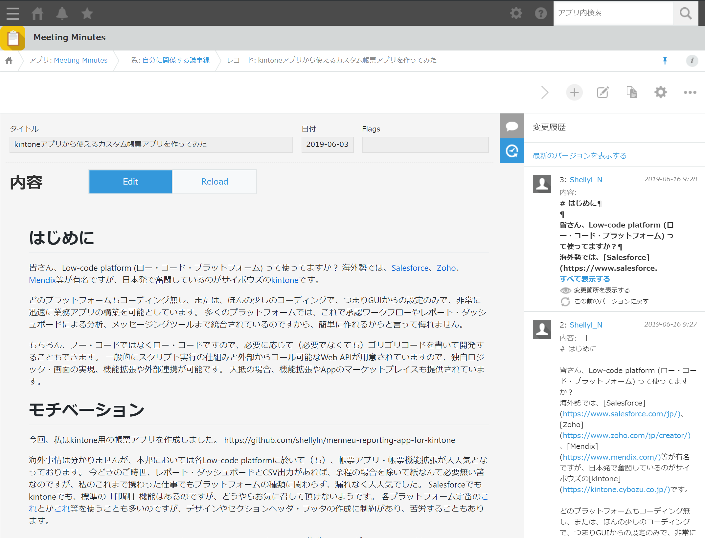
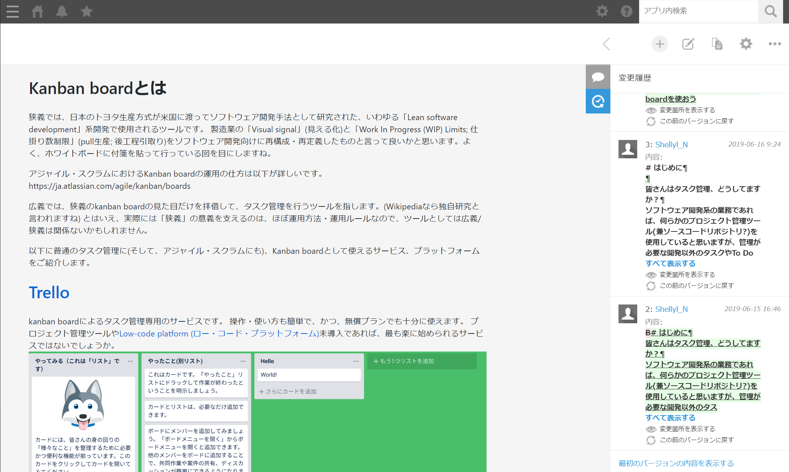
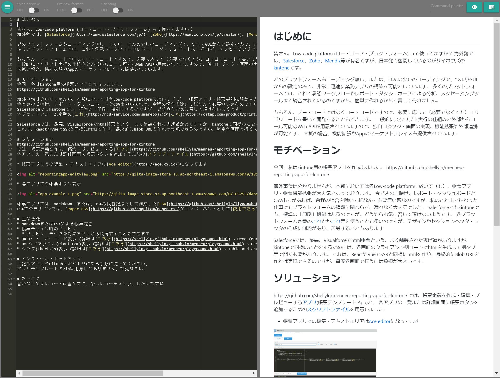
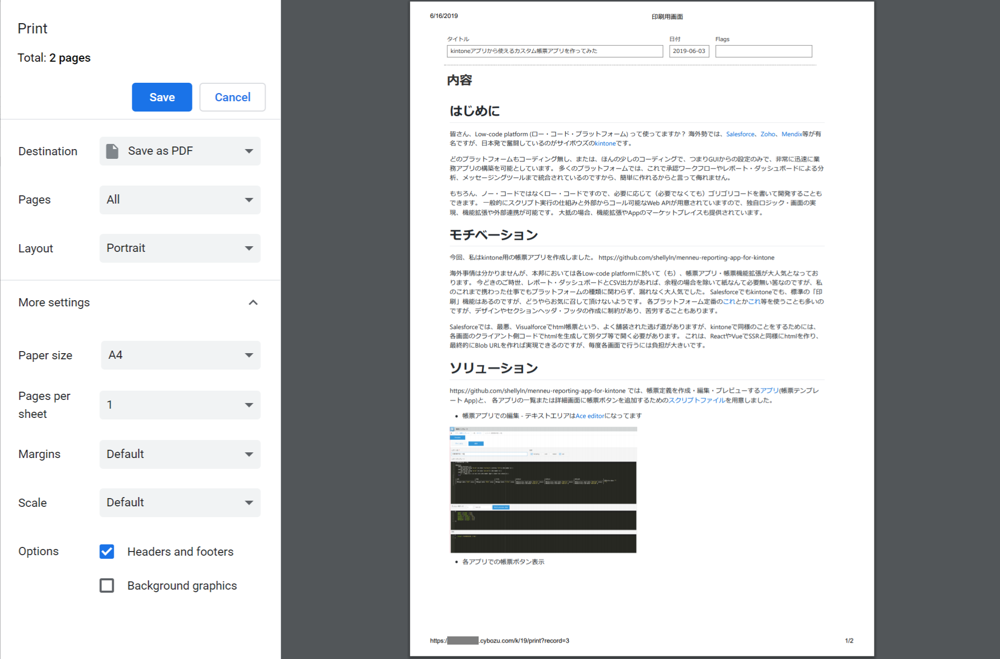
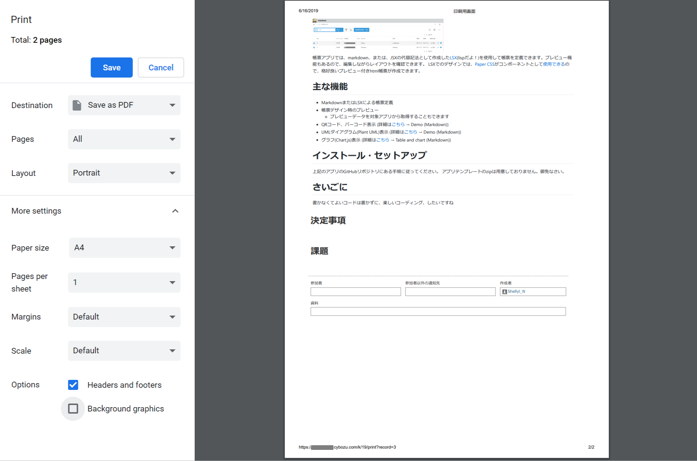
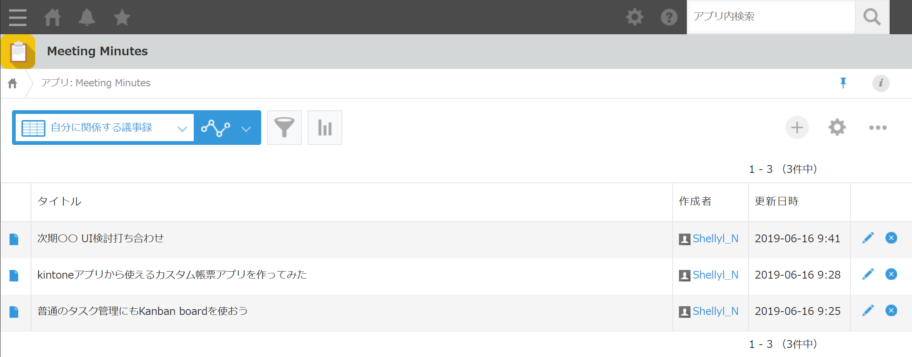
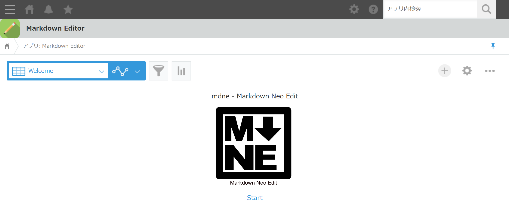
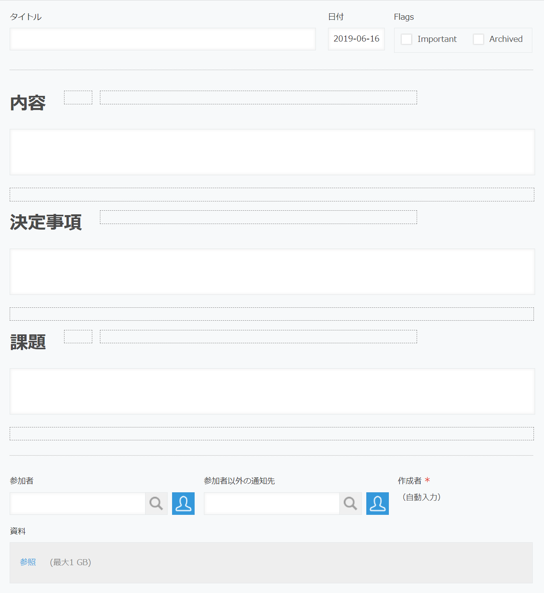

# 📝 mdne for kintone ☁️
### Edit kintone fields with powerful markdown and code editor.


* mdne - Markdown Neo Edit
  * [npm](https://www.npmjs.com/package/mdne)
  * [github](https://github.com/shellyln/mdne)


# 📍 Features

* Launch external markdown editor (mdne) from standard detail view for editing the field.
* Render markdown fields in the standard detail view and standard print view.

# 🖼 Gallery

## View markdown fields with standard detail view

* Click `Edit` button to launch the external editor (mdne).
* Click `Reload` button to refresh the contents edit by external editor.





## Launch external markdown editor (mdne) from standard detail view for editing the field



## Print a record





## List view



## mdne app's splash screen




# 💻 Requiments
* kintone (>=Professional:en / >=Standard:jp)
* browser
  * Google Chrome: latest
  * Firefox: latest

# ⚙️ Setup

## 📝 Markdown Editor App

Launch mdne (Markdown Neo Edit) as a external markdown editor for editing the fields.


### List views

#### Welcome

* Please set the default list view.

See [list-welcome.html](https://github.com/shellyln/mdne-for-kintone/blob/master/src/md-editor-app/list-welcome.html).

#### mdne

See [list-mdne.html](https://github.com/shellyln/mdne-for-kintone/blob/master/src/md-editor-app/list-mdne.html).

### JS and CSS
#### JS (PC)
* [mdne-kintone-backend.js](https://github.com/shellyln/mdne-for-kintone/blob/master/src/md-editor-app/mdne-kintone-backend.js)
  * **Please do not register the above URL directly. It is not a CDN URL.**
* [loading.js](https://github.com/shellyln/mdne-for-kintone/blob/master/src/md-editor-app/loading.js)
  * **Please do not register the above URL directly. It is not a CDN URL.**

#### CSS

No stylesheets needed.

### Fields

No fields needed.


------

## 📋 Meeting Minutes App

Customize the following application example.  
https://kintone-sol.cybozu.co.jp/apps/005-gijiroku.html (📋 議事録管理 App; Meeting Minutes App)


### JS and CSS
#### JS (PC)
* https://unpkg.com/react@16/umd/react.production.min.js
* https://unpkg.com/react-dom@16/umd/react-dom.production.min.js
* https://unpkg.com/mdne@0.1.33/contents/assets/vendor/menneu-0.1.0/menneu.min.js
* [user-app-config.js](https://github.com/shellyln/mdne-for-kintone/blob/master/src/meeting-minutes-app/user-app-config.js)
  * **Please do not register the above URL directly. It is not a CDN URL.**
  * Please edit this file to show the button of the defined report.
    * XLcCNs2aUCv93L7W__EDITOR_APP_ID
    * XLcCNs2aUCv93L7W__EDITOR_VIEW_ID
    * XLcCNs2aUCv93L7W__TARGET_FIELD_SETS
* [user-app-events.js](https://github.com/shellyln/mdne-for-kintone/blob/master/src/meeting-minutes-app/user-app-events.js)
  * **Please do not register the above URL directly. It is not a CDN URL.**


`user-app-config.js`
```js
const XLcCNs2aUCv93L7W__EDITOR_APP_ID  = '18';
const XLcCNs2aUCv93L7W__EDITOR_VIEW_ID = '5118342';

const XLcCNs2aUCv93L7W__TARGET_FIELD_SETS = [{
    textFieldCode: 'document',
    displayFieldCode: 'document_display',
    buttonFieldCode: 'document_buttons',
    ext: 'md',
}, {
    textFieldCode: 'decisions',
    displayFieldCode: 'decisions_display',
    buttonFieldCode: 'decisions_buttons',
    ext: 'md',
}, {
    textFieldCode: 'issues',
    displayFieldCode: 'issues_display',
    buttonFieldCode: 'issues_buttons',
    ext: 'md',
}];
```

#### CSS
* [51-modern-default.css](https://github.com/kintone/plugin-examples/blob/master/stylesheet/51-modern-default.css)
  * **Please do not register the above URL directly. It is not a CDN URL.**


### Fields




|Field Code|Caption|Value|Type|Required|
|----------|-------|-----|----|--------|
|title|タイトル||Textbox||
|date|日付||Date|X|
|flags|Flags|Important,Archived|Checkboxes||
||内容||Label||
|document_buttons|||BlankSpace||
|document|内容||Textarea||
|document_display|||BlankSpace||
||決定事項||Label||
|decisions_buttons|||BlankSpace||
|decisions|決定事項||Textarea||
|decisions_display|||BlankSpace||
||課題||Label||
|issues_buttons|||BlankSpace||
|issues|課題||Textarea||
|issues_display|||BlankSpace||
|attendee|参加者||UserSelect||
|person_concerned|参加者以外の通知先||UserSelect||
|attachments|資料||Attachements||
|作成者|作成者||creator|X|
|作成日時|作成日時||createdDt|X|
|更新者|更新者||modifier|X|
|更新日時|更新日時||updatedDt|X|


------

# ⚖️ License

* MIT

Copyright (c) 2019 Shellyl_N
